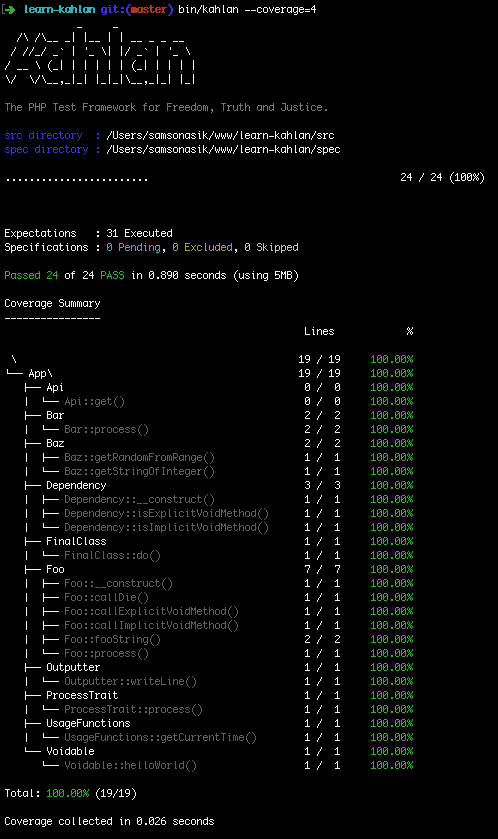

# learn-kahlan

[](https://travis-ci.org/sitrunlab/learn-kahlan)
[](https://coveralls.io/github/sitrunlab/learn-kahlan?branch=master)

Consume
-------

```bash
$ git clone https://github.com/sitrunlab/learn-kahlan.git
$ cd learn-kahlan
$ composer install
$ bin/kahlan --coverage=4
```

You will get the following output:



Get Html Report
---------------
```
$ npm install -g nyc
$ mkdir .nyc_output
$ ./bin/kahlan --istanbul=.nyc_output/coverage.json
$ nyc report --reporter=html --extension=".php"
$ open coverage/index.html
```

or

```
$ brew install lcov
$ mkdir lcov
$ ./bin/kahlan --lcov="lcov/coverage.info"
$ cd lcov
$ genhtml coverage.info
$ open index.html
```
